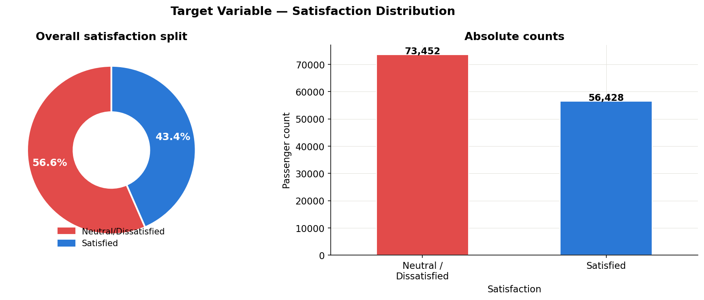
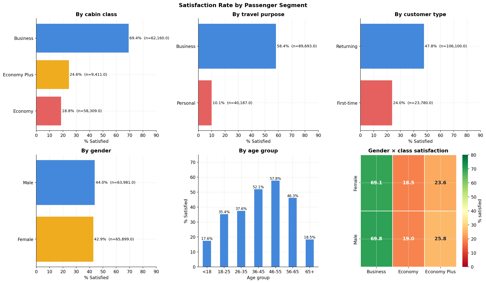
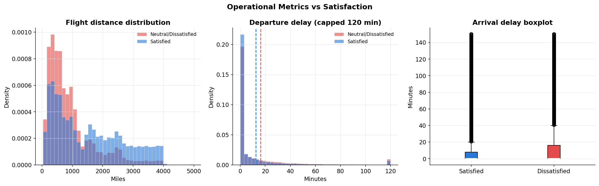
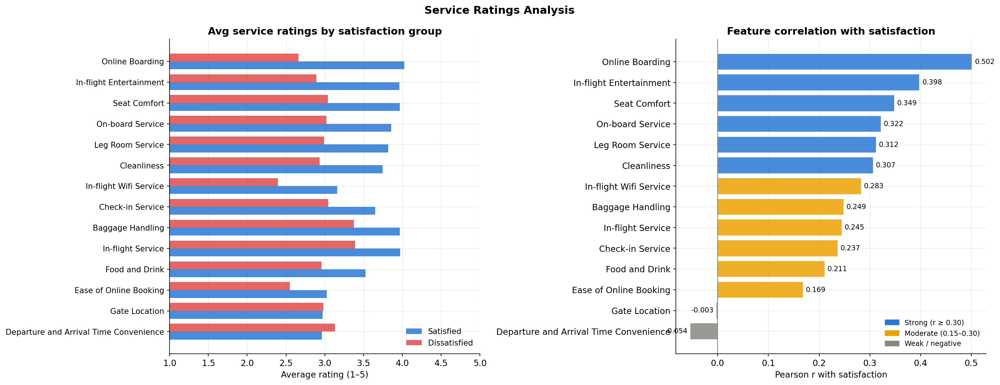
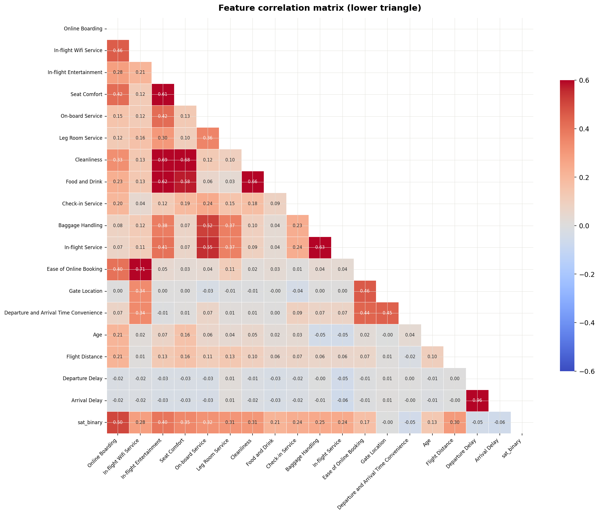
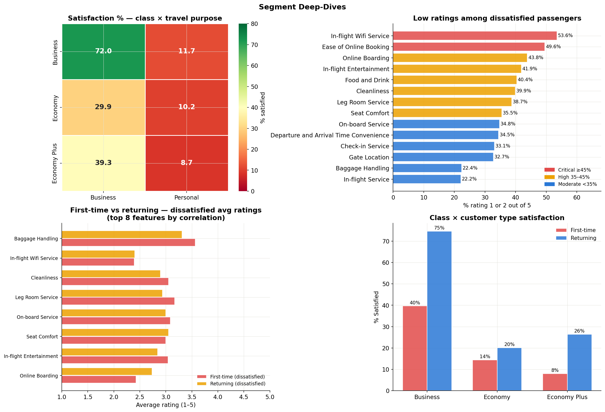
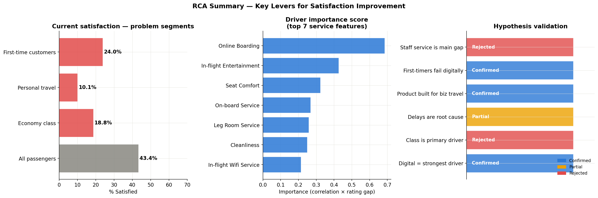

# Airline Passenger Satisfaction — Exploratory Data Analysis

An end-to-end EDA on 129,880 airline passengers identifying the key drivers of satisfaction and dissatisfaction.

---

## Dataset

- **Source:** [Airline Passenger Satisfaction — Kaggle](https://www.kaggle.com/datasets/teejmahal20/airline-passenger-satisfaction)
- **Rows:** 129,880 passengers
- **Features:** 24 columns — passenger profile, flight details, 14 service ratings, and overall satisfaction
- **Target:** `Satisfied` or `Neutral or Dissatisfied`

> Note: A service rating of 0 means "not applicable" and is treated as missing (NaN) in this analysis.

### Feature Groups

| Group | Columns |
|---|---|
| Passenger Profile | Gender, Age, Customer Type, Type of Travel, Class |
| Flight Info | Flight Distance, Departure Delay, Arrival Delay |
| Service Ratings (1–5) | Online Boarding, Seat Comfort, In-flight Entertainment, In-flight Wifi, Food and Drink, Cleanliness, Leg Room Service, On-board Service, Baggage Handling, Check-in Service, Gate Location, Departure/Arrival Time Convenience, Ease of Online Booking, In-flight Service |

---

## Key Findings

### Overall Satisfaction

Only **43.4%** of passengers are satisfied (56,428 out of 129,880). The airline is failing the majority of its customers.



---

### Segment Profiles

Satisfaction varies drastically by segment:

| Segment | % Satisfied |
|---|---|
| Business travel | 58.4% |
| Business class | 69.4% |
| Returning customers | 47.8% |
| Economy class | 18.8% |
| Economy Plus | 24.6% |
| Personal travel | 10.1% |
| First-time customers | 24.0% |

Economy Plus and Economy perform nearly identically despite being different tiers — a clear product gap. The worst combination: **Economy + Personal travel at just 5.2% satisfaction**.



---

### Operational Metrics

- Dissatisfied passengers experience higher departure and arrival delays on average
- **13,648 passengers (10.51%)** departed late but arrived on time — the airline recovered in ~1 in 10 cases
- Satisfied passengers skew toward longer flights; dissatisfied passengers dominate shorter routes



---

### Service Ratings & Key Drivers

Correlation of service features with satisfaction (Pearson r):

| Feature | r | Strength |
|---|---|---|
| Online Boarding | 0.502 | Strong |
| In-flight Entertainment | 0.398 | Strong |
| Seat Comfort | 0.349 | Strong |
| On-board Service | 0.322 | Strong |
| Leg Room Service | 0.312 | Strong |
| Cleanliness | 0.307 | Strong |
| In-flight Wifi Service | 0.283 | Moderate |
| Gate Location | −0.003 | None |
| Departure/Arrival Time Convenience | −0.054 | Negative |

**Online Boarding is the single strongest driver** — and as a digital product, the cheapest and fastest to improve.

Among dissatisfied passengers, the highest proportion of low ratings (1 or 2 out of 5) go to:
- In-flight Wifi Service (53.6% rated 1–2)
- Ease of Online Booking (49.6%)
- Online Boarding (43.8%)



---

### Feature Correlation Matrix

Strong inter-feature correlations worth noting:
- In-flight Entertainment ↔ Seat Comfort (r = 0.61)
- Cleanliness ↔ In-flight Entertainment (r = 0.69)
- Ease of Online Booking ↔ In-flight Wifi Service (r = 0.71)
- Departure Delay ↔ Arrival Delay (r = 0.96)



---

### Segment Deep-Dives

First-time dissatisfied passengers rate Online Boarding significantly lower than returning dissatisfied passengers — pointing to a digital onboarding gap specific to new users.

Class × customer type interaction: first-time Business class passengers still reach 40% satisfaction vs 8% for first-time Economy Plus — class matters, but not enough to rescue the new-customer experience in economy.



---

### RCA Summary

**Hypotheses tested:**

| Hypothesis | Result |
|---|---|
| Staff service is the main gap | Rejected |
| First-timers fail digitally | Confirmed |
| Product is built for business travel | Confirmed |
| Delays are root cause | Partial |
| Class is the primary driver | Rejected |
| Digital features = strongest driver | Confirmed |



---

## Recommendations

| Priority | Action | Why |
|---|---|---|
| 1 | Fix Online Boarding | Highest correlation (r = 0.502); digital product, fast to ship |
| 2 | Improve first-time passenger experience in Economy | Only 24% satisfied on their very first flight |
| 3 | Address personal travel pain points | Delays and leg room matter most beyond the standard digital drivers |
| 4 | Differentiate Economy Plus meaningfully | Currently indistinguishable from Economy in satisfaction (24.6% vs 18.8%) |

---

## Setup

```bash
git clone https://github.com/Arushi1104/Airline_Passenger_Satisfaction.git
cd Airline_Passenger_Satisfaction
pip install pandas numpy matplotlib seaborn
```

Place `Airline_satisfaction.csv` in the project root, then open and run `Airline_Satisfaction_EDA.ipynb` top to bottom.

---

## Project Structure

```
airline-eda/
├── Airline_satisfaction.csv              # Raw dataset
├── data_dictionary.csv                   # Feature descriptions
├── Airline_Satisfaction_EDA.ipynb        # Main analysis notebook
├── README.md
├── fig_01_satisfaction_distribution.png  # Overall satisfaction split
├── fig_02_segment_profiles.png           # Satisfaction by class, travel type, customer type, gender, age
├── fig_03_operational_metrics.png        # Flight distance, delay distributions
├── fig_04_service_ratings.png            # Avg ratings + correlation with satisfaction
├── fig_05_correlation_matrix.png         # Feature-to-feature correlation heatmap
├── fig_06_segment_deepdives.png          # Class × travel, low ratings, first-time vs returning
└── fig_07_rca_summary.png               # Problem segments, driver importance, hypothesis validation
```

---

## Tech Stack

Python 3 · Pandas · NumPy · Matplotlib · Seaborn

---

## Author

**Arushi Khanna** — [GitHub](https://github.com/Arushi1104)
